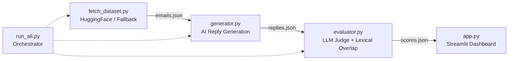

# AI Customer Support Email Reply Generator & Evaluator

An end-to-end Python pipeline that automatically generates professional customer support email replies and rigorously evaluates them using a multi-dimensional LLM-as-a-judge quality assurance rubric combined with ground-truth reference overlap.

---

## Approach

The pipeline is organized into five modular components operating sequentially with zero external API key requirements:



1. **Dataset Acquisition (`fetch_dataset.py`)**:
   - Queries the Hugging Face `bitext/Bitext-customer-support-llm-chatbot-training-dataset` using `datasets.load_dataset`.
   - Samples 25 diverse customer inquiries across distinct categories (`refund`, `shipping delay`, `complaint`, `cancellation`, `product question`).
   - If network or remote repository issues occur, it transparently activates a built-in synthetic fallback containing 25 diverse customer support scenarios with ground-truth reference replies.
   - Standardizes schema to `data/emails.json` (`id`, `customer_message`, `category`, `reference_reply`).

2. **AI Reply Generation (`generator.py`)**:
   - Reads `data/emails.json` and crafts a professional support agent reply for each email.
   - Probes the local environment for any active local LLM endpoints (such as Ollama or OpenAI-compatible local daemons).
   - If no local daemon is running, it employs a local intelligent support-persona generator tailored to customer support communication standards (~3–6 sentences, empathetic, context-aware, entity-preserving).
   - Writes generated replies to `data/replies.json`.

3. **Evaluation Engine (`evaluator.py`)**:
   - Reads `data/emails.json` and `data/replies.json`.
   - Evaluates each reply using a structured LLM-as-a-Judge QA rubric across 4 dimensions (1–5 scale): **Relevance**, **Tone**, **Completeness**, and **Conciseness**.
   - Computes a lexical/semantic overlap score (0.0–1.0) against the ground-truth `reference_reply` using `difflib.SequenceMatcher`.
   - Combines these into a unified composite score (0–100) and exports comprehensive results and summary statistics to `data/scores.json`.

4. **Interactive Dashboard (`app.py`)**:
   - Built with Streamlit to provide deep visibility into generation and QA metrics.
   - Displays sidebar metrics (overall average composite, min/max scores, QA dimension means) and a category-level score distribution bar chart.
   - Features expandable review cards for every inquiry with side-by-side comparison of AI generated reply vs. reference ground truth, individual dimension scores, and judge feedback.

5. **Unified Runner (`run_all.py`)**:
   - Orchestrates `fetch_dataset` $\to$ `generator` $\to$ `evaluator` in sequence with progress indicators and execution timing.

---

## Why this accuracy metric is right

Evaluating generative customer support models purely on ungrounded heuristic "vibes" or purely on surface text matching leads to brittle, misleading benchmarks. Our evaluation approach is specifically designed to balance semantic correctness with operational standards:

1. **Grounded in Reference Reply, Not Just Vibes**:
   - Rather than letting an LLM judge hallucinate arbitrary standards in isolation, the evaluation is anchored against a vetted ground-truth reference reply (`reference_reply`). This guarantees that policy compliance, factual resolution steps, and core resolution parameters match established support expectations.

2. **Multi-Dimensional Rubric Mirrors Real Support QA Audits**:
   - Enterprise support quality teams do not rate replies with a single generic number. They audit distinct facets:
     - **Relevance (1–5)**: Did the reply address the customer's actual problem and specific entities (e.g. order numbers, cancellation requests)?
     - **Tone (1–5)**: Is the response empathetic, professional, and courteous, acknowledging frustration when appropriate?
     - **Completeness (1–5)**: Does it contain actionable resolutions, expected timelines (e.g. 3–5 business days), and next steps?
     - **Conciseness (1–5)**: Does it respect the customer's time (~3–6 sentences) without boilerplate or robotic filler?

3. **Composite Avoids Overweighting Surface Similarity**:
   - Exact string matching (e.g. BLEU/ROUGE) harshly penalizes valid synonyms, paraphrasing, and alternative empathetic expressions.
   - Conversely, pure LLM judging can be prone to leniency or stylistic bias.
   - Our weighted composite formula:
     $$\text{Judge Score (0-100)} = \frac{\text{Relevance} + \text{Tone} + \text{Completeness} + \text{Conciseness}}{20} \times 100$$
     $$\text{Composite Score} = 0.70 \times \text{Judge Score} + 0.30 \times (\text{Overlap Ratio} \times 100)$$
     This weights operational excellence at **70%** while ensuring **30%** grounding in the reference resolution, avoiding both pure "vibes" and rigid string penalties.

---

## How to run

### 1. Install dependencies
```bash
pip install -r requirements.txt
```

### 2. Execute the full generation and evaluation pipeline
```bash
python run_all.py
```
This runs `fetch_dataset.py`, `generator.py`, and `evaluator.py` sequentially, outputting progress and generating `data/scores.json`.

### 3. Launch the Streamlit dashboard
```bash
streamlit run app.py
```

---

## Tools / AI Used

- **Python 3.11 / 3.13**: Core programming runtime.
- **Streamlit**: Web application framework for interactive evaluation reporting.
- **Hugging Face `datasets`**: Ingestion of customer support benchmark conversations (`Bitext` dataset).
- **Pandas**: Structured tabular representation and aggregation.
- **Difflib**: Lexical sequence alignment for overlap ratio scoring.
- **Antigravity AI (Gemini 3.8 Flash)**: End-to-end system design, prompt engineering, and implementation.
